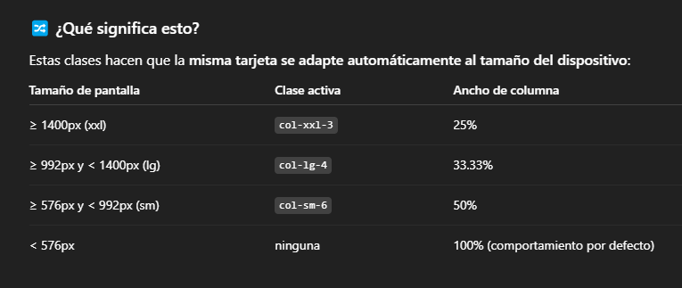

# BOOTSTRAP

Hace que las paginas sean responsive

Para que funcione se debe agregar:

        <!DOCTYPE html>
        <html lang="en">
        <head>
            <meta charset="UTF-8">
            <meta name="viewport" content="width=device-width, initial-scale=1.0">
            <title>Document</title>

            //se agrega el link

            <link href="https://cdn.jsdelivr.net/npm/bootstrap@5.0.2/dist/css/bootstrap.min.css" rel="stylesheet" integrity="sha384-EVST    azprG1Anm3QDgpJLIm9Nao0Yz1ztcQTwFspd3yD65VohhpuuCOmLASjC" crossorigin="anonymous"/>

        </head>
        <body>
            <h1>Hola Angarita</h1>
        </body>

        //se agrega el script

         
        </html>

## Elementos

bootstrap ya tiene muchos elementos creados por defecto (navbar, carrusel, cards, modales y formularios, etc), sin embargo estos se pueden modificar con nuestros propios css, o les podemos agregar mas clases del mismo bootstrap, como:

📌 Clases de alineación de texto

    text-left — Alinea a la izquierda

    text-center — Alinea al centro

    text-right — Alinea a la derecha

    text-justify — Justifica el texto

📏 Espaciado vertical (margin-top, margin-bottom)

    mt-2, mt-4, mt-6, mt-8 — Margen superior

    mb-2, mb-4, mb-6, mb-8 — Margen inferior

    my-2, my-4 — Margen vertical (arriba y abajo)

✏️ Tamaño del texto

    text-sm — Texto pequeño

    text-base — Texto normal

    text-lg — Texto grande

    text-xl, text-2xl, text-3xl, text-4xl — Titulares

🎨 Color del texto

    text-gray-700 — Gris oscuro

    text-blue-600 — Azul fuerte

    text-red-500 — Rojo medio

    text-green-500 — Verde medio

🔠 Estilo de fuente

    font-bold — Negrita

    font-semibold — Semi-negrita

    font-medium — Media

    font-light — Ligera

    italic — Cursiva

    uppercase — Mayúsculas

    tracking-wide — Espaciado entre letras

🧱 Tamaño y estilo del contenedor

    container mx-auto — Centrado con márgenes automáticos

    max-w-md, max-w-lg, max-w-xl — Limita el ancho máximo

📚 ¿Qué son .row y .col?

- En Bootstrap, las clases .row y .col se utilizan para construir sistemas de diseño en cuadrícula (grid layout) responsivos. Este sistema divide la pantalla en 12 columnas para organizar contenido de forma flexible.

🔹 .row

- La clase .row crea una fila horizontal que contiene columnas (.col). Esta fila asegura que las columnas estén alineadas correctamente y tengan espacio entre ellas (gutter).

        

        <!-- Aquí van las columnas -->
        

    
🔹 .col
- La clase .col representa una columna dentro de la fila. Si usas .col sin número, todas las columnas dentro de la fila se reparten equitativamente el ancho disponible.

        

        
Columna 1

        
Columna 2

        

- Puedes usar variantes con número (.col-6, .col-4, etc.) para definir cuántas de las 12 columnas ocupa cada una:

        

        
Ocupa 4 de 12 columnas

        
Ocupa 8 de 12 columnas

        

- Para hacerlo aun mas responsive:

        

Aquí estás usando columnas responsivas, que cambian de tamaño según el ancho de la pantalla. Vamos parte por parte:

🧱 col-xxl-3

    Aplica cuando la pantalla es extra extra grande (≥1400px).

    El ancho de la columna será 3/12 (es decir, 25%).

🧱 col-lg-4

    Aplica cuando la pantalla es grande (≥992px).

    El ancho será 4/12 (33.33%).

🧱 col-sm-6

    Aplica cuando la pantalla es pequeña (≥576px).

    El ancho será 6/12 (50%).

Extra:

- d-flex: convierte el div en un contenedor flex.

- justify-content-center: centra horizontalmente el contenido (en este caso, la tarjeta .card).

