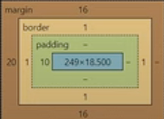

# plugins que use:

codeium
HTML CSS Support
HTML Snippets
JavaScript (ES6) code snippets 

# Conceptos importantes
# HTML
index.html : es la pagina principal del proyecto, la pagina por defecto

HTML: sirve para estructurar elementos en la web
ancor: sirve para generar linkls a otras paginas web
etiquetas (vienen con atributos por defecto ): 
   
    hr (linea horizontal),
    buttom (boton),
    em (cursiva),
    br (salto de linea),
    p (parrafo),
    a (ancor, se usa href para saber donde redirigir, target pra saber como redirigir, id para darle nombre y poder ir en la misma pagina), 
    img(imagenes), 
    table(su nombre lo dice no jodas), 
    tbody(cuerpo de la tabla), 
    tr(filas de tablas), 
    th(header columnas,  tiene negrilla),
    td(contenido columnas) 
    ol(lista ordenada), 
    ul (lista no ordenada),
    dl (lista de definición),
    li (item de lista),
    strong (letra en negrilla),
    style (da estilo al html),
    div y span (conjunto de etiquetas)

Para la etiqueta meta:
        
    meta (va en el header, sirve para determianda cosa dependiendo el name, ej:keyboards y robots)

existen html entities, sirven para que este mejor optimizado, ahi estan comillas, siumbolo de copyright, monedas entre otros

flat icon intentar cvg

### Clases

atributos que se le pueden poner a las etiquetas y funciona para darle un estilo a cada etiqueta que tenga esa clase

### displays:

    inline : se pone uno al lado del otro (span)
    block : se pone uno arriba del otro (div), aca se puede cambia la altura, en inline no.

    Asi una etiqueta tenga por defecto un display, este se puede cambiar

    inline-block: se ponen una al lado de la otra pero se puede modificar como un inline

    Flex: flex solo se le asigna al contenedor padre, en este se puede modificar la posicion de las cosas agregando un eje principal (flex-direction), en esta clased padre se pueden asignar mas cosas pero los hijos al estar dentro de la clase padre con flex tambien desbloquean atributos
/////////
## CSS
En el head se debe agregar:  <link rel="stylesheet" href="css/styles.css"> 
sirve para dar estilo a la pagina web

Selectores:
    puedo agregar ciertos atributos a etiquetas de html, como color de fondo, color de letra, margenes, tamano de letra, etc

    se usan clases (.clase), ids (#id),  y etiquetas (etiqueta) para darle el estilo, aunque hay mas (* , el and que seria expresado por puntos, el or serian las comas,  el espacio es para decendencia de todos los atributos, el mayor que es para herencia de un grado )

pseudo selectores:

    ocurre algo cuando se interactua o ya se interactuo con la etiqueta o cuando es una tabla, se hacen poniendo la etiqueta o el #id, los dos puntos y luego la propiedad (#id:hover), hover es un ejemplo, este hace que cambie si el mause esta sobre la etiqueta

box-sizing: border-box, hace que el tamanio de las cajas cuenten el borde, asi si tenemos dos cajas con el 50 porciento estas caben en toda la pantalla

### Modelode caja:

    todos son cajas, estas contienen: contenido, padding, borde y margen

## HTML5

agregaron equitecas semanticas, como header, section, flutter, main y article (sobre todo para obejetos pequenios que tienen info por si solos, como una card) que mas que funcionalidades representan es orden, trabajan como un div sin embargo es buena practica usar estos, se genera un codigo mas limpio, esto ayuda a motores de busqueda